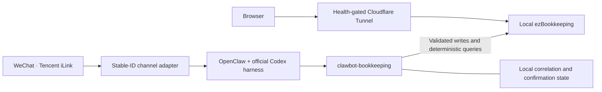

<div align="center">

# Clawbot

**A self-hosted WeChat bookkeeping assistant powered by OpenClaw and ezBookkeeping.**

Turn everyday messages into validated expenses, reliable receipts, and precise ledger queries.

[](#requirements)
[](https://github.com/openclaw/openclaw)
[](https://github.com/mayswind/ezbookkeeping)
[](openclaw-plugins/)
[](scripts/)

[Features](#features) · [Architecture](#architecture) · [Development](#development) · [Documentation](#documentation) · [Privacy](#privacy-and-security)

</div>

---

Clawbot connects a dedicated WeChat conversation to a personal ezBookkeeping ledger. OpenClaw and the official Codex harness interpret the message; a local plugin validates the request, calls the ledger API, and produces the authoritative reply.

The project targets a **single owner, one SGD expense account, and an always-on Windows host**. It includes the integration code, tests, deployment scripts, and configuration templates. Running it requires your own services and credentials; cloning this repository does not start a bot or provide access to a ledger.

## Features

- **Conversational expense entry.** Understand amounts, categories, explicit dates, and notes, with SGD and `Asia/Singapore` as the current defaults.
- **Confirmation before ambiguous writes.** A questionable expense becomes a temporary proposal. A separate confirmation records it; rejection cancels it.
- **Receipts backed by the ledger API.** Report success only after a confirmed write. Distinguish a definite failure from an uncertain submission.
- **Message-based deduplication.** Correlate trusted sender metadata and upstream message IDs so the same inbound message cannot create a second expense. Identical text in a new message remains a separate event.
- **Deterministic summaries.** Calculate totals, counts, category breakdowns, and the largest expenses for a date range, with optional category or note filters.
- **Exact amount search.** Find individual SGD expenses using ezBookkeeping's server-side amount filter. Search all history by default or narrow the date range.
- **A browser view of the same ledger.** Use the native ezBookkeeping interface through a health-gated Cloudflare Tunnel.
- **Controlled Windows releases.** Publish immutable, hash-verified releases outside the development checkout, with a separate test instance and verified rollback support.

### Example requests

These are illustrative Chinese inputs for the current bookkeeper:

| Request | Intended behavior |
| --- | --- |
| `午饭花了7.20新币` | Record one explicit expense and return its receipt. |
| `午饭7.20吗` | Ask for confirmation before writing. |
| `今天花了多少钱` | Return a deterministic daily summary. |
| `帮我查一下账本里有没有3.36的账` | Search for expenses whose individual amount is exactly 3.36 SGD. |

Exact amount search shows the latest three matches by default, supports up to ten displayed results, and explicitly indicates when more matches exist. An API failure never becomes a misleading “no records found” answer.

## Architecture



The model interprets intent; the bookkeeping plugin enforces account, currency, category, message-correlation, and write rules. Pending confirmations and authoritative replies persist in local SQLite so they can survive Gateway restarts and cross-instance tool execution.

The Tunnel supervisor verifies the production process, explicit configuration, health response, and login-page fingerprint before publishing the origin. If those checks fail, it stops its own Tunnel child and closes the public path.

### Service boundaries

| Service | Binding / role |
| --- | --- |
| Production ezBookkeeping | `127.0.0.1:8888`; personal ledger |
| Isolated test ezBookkeeping | `127.0.0.1:18888`; separate configuration, credentials, and database |
| OpenClaw Gateway | `127.0.0.1:18789`; dedicated owner-bound bookkeeper |
| Browser access | Cloudflare Tunnel to the guarded production origin; native ezBookkeeping login |

### Tool surface

| Tool | Purpose | Deployment status |
| --- | --- | --- |
| `record_expense` | Validate and record one explicit expense | Enabled |
| `prepare_expense` | Prepare a temporary confirmation proposal | Enabled |
| `resolve_expense_confirmation` | Confirm or cancel the current proposal | Enabled |
| `summarize_expenses` | Compute deterministic expense summaries | Enabled |
| `find_expenses` | Search individual expenses by exact SGD amount | Enabled |
| `ezbookkeeping__query_transactions` | Owner-scoped, read-only native MCP history queries | Implemented; not activated |

The optional MCP integration requires a separately enabled local service and its own token. Expense writes, summaries, and exact amount searches use the HTTP API and do not depend on MCP. Native MCP transaction creation is excluded from the tool allowlist.

## Project status

This is a working personal deployment, with behavior and operational constraints documented as of **2026-09-06**.

- Expense entry, confirmation, summaries, and exact amount search are enabled.
- The exact amount search release passed its local checks and a live WeChat acceptance test. See the [release record](docs/handoffs/2026-09-06-amount-search-release.md) for the evidence and rollback boundary.
- Native MCP history queries remain inactive.
- A real platform replay using the same upstream message ID remains an outstanding acceptance check. Automated deduplication tests do not close that gap; overall deployment acceptance remains incomplete.

The current setup intentionally focuses on one owner's SGD expenses. Additional currencies, account selection, and broader ledger operations require deliberate changes to the validation and authorization model.

## Development

### Requirements

- Windows with PowerShell for the deployment and operations scripts.
- A Node.js version supported by OpenClaw 2026.8.2: `>=22.22.3 <23`, `>=24.15.0 <25`, or `>=25.9.0`.
- npm and Git.
- OpenClaw 2026.8.2 and ezBookkeeping 1.6.1 for service integration.

### Run the local checks

From the repository root, install the locked dependencies and run the plugin checks:

```powershell
Push-Location openclaw-plugins\clawbot-bookkeeping
npm.cmd ci
npm.cmd test
Pop-Location

Push-Location openclaw-plugins\openclaw-weixin-stable-id
npm.cmd ci
npm.cmd run build
node --test test\inbound-message-id.test.mjs
Pop-Location
```

Repository tests must never target the production ledger on port `8888`. Real ledger integration checks require the isolated `18888` instance and its separate test credentials.

### Configure and deploy

1. Read the [Windows handoff](WINDOWS-HANDOFF.md) and [Ledger runbook](docs/ledger-cloudflare-runbook.md).
2. Configure your own owner binding and services from the templates in [`config/`](config/). Keep live credentials and runtime state outside Git.
3. Authenticate the dedicated bookkeeper through the official Codex harness using the documented interactive setup.
4. Validate against the isolated test ledger.
5. Publish a manifest-verified immutable release, then follow the runbook's service, browser, restart, fail-closed, and WeChat acceptance checks.

State-changing installation, migration, publication, and restart scripts support `-WhatIf`. Preview the documented operation before applying it. Production loads a verified release outside this checkout; editing source files does not deploy them.

## Repository layout

| Path | Contents |
| --- | --- |
| [`openclaw-plugins/clawbot-bookkeeping/`](openclaw-plugins/clawbot-bookkeeping/) | Trusted writes, confirmations, summaries, amount search, optional MCP resolver, and tests |
| [`openclaw-plugins/openclaw-weixin-stable-id/`](openclaw-plugins/openclaw-weixin-stable-id/) | Tencent Weixin adapter variant preserving upstream message IDs and sender metadata |
| [`openclaw-hooks/session-memory/`](openclaw-hooks/session-memory/) | Version-checked hook protecting the immutable bookkeeper workspace |
| [`openclaw-workspace/`](openclaw-workspace/) | Dedicated bookkeeper instructions and behavior contracts |
| [`config/`](config/) | Sanitized service templates and category configuration |
| [`scripts/`](scripts/) | Windows installation, migration, release, Tunnel supervision, and verification |
| [`docs/`](docs/) | Designs, implementation plans, operational runbooks, and acceptance records |
| [`research/`](research/) | Notes comparing bookkeeping integration options |

## Documentation

Most detailed operational documents are currently written in Chinese.

- [Windows setup and recovery](WINDOWS-HANDOFF.md)
- [Cloudflare Tunnel deployment and acceptance runbook](docs/ledger-cloudflare-runbook.md)
- [Exact amount search release](docs/handoffs/2026-09-06-amount-search-release.md)
- [WeChat reply correlation repair and remaining acceptance gap](docs/handoffs/2026-09-05-wechat-stale-reply-repair.md)
- [Expense category contract](docs/expense-categories.md)
- [Repository contributor and agent guidance](AGENTS.md)

## Privacy and security

The repository is intended to hold reproducible code and sanitized configuration. Live credentials, WeChat identities, conversation transcripts, ledger databases, backups, and runtime logs belong outside version control. The ignore rules help prevent accidental additions, but do not remove information already present in Git history.

- Restrict the bookkeeper to its configured owner and account.
- Keep HTTP and MCP tokens separate and local; never place them in prompts or receipts.
- Keep production, test, and Gateway listeners on loopback.
- Keep registration and ineffective password recovery disabled.
- Use the native ledger login for browser access; the deployment does not add Cloudflare Access.
- Do not retry a write whose result is uncertain until the ledger has been checked.

**Self-hosted storage does not mean local-only inference.** Bookkeeping requests and the query results needed for a reply are processed through the configured OpenAI Codex session. Credentials are not part of that model context.

## Contributing

Review [`AGENTS.md`](AGENTS.md), keep changes focused, and use Conventional Commits. Add a regression test for a behavior change and run the relevant checks before submitting it. Use synthetic test data and the isolated ledger; never attach real credentials, conversations, or transactions to an issue or pull request.

## Acknowledgments and licensing

Clawbot builds on [OpenClaw](https://github.com/openclaw/openclaw), [ezBookkeeping](https://github.com/mayswind/ezbookkeeping), and Tencent's Weixin channel adapter.

The included Tencent adapter retains its [MIT license and copyright notice](openclaw-plugins/openclaw-weixin-stable-id/LICENSE). **A repository-wide license has not yet been declared.** The adapter's license should not be interpreted as a license for every file in this repository.
