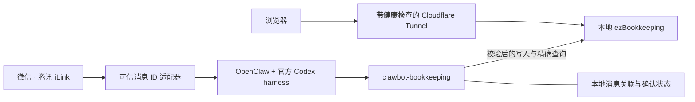

<div align="center">

# WeChat Clawbot Ledger

**基于 OpenClaw 与 ezBookkeeping 的微信个人记账助手**

在微信里记录日常支出，获取可靠回执，随时查询自己的账本。

[](#选择部署系统)
[](https://github.com/openclaw/openclaw)
[](https://github.com/mayswind/ezbookkeeping)
[](openclaw-plugins/)
[](scripts/)

[效果展示](#效果展示) · [功能特性](#功能特性) · [系统架构](#系统架构) · [本地开发](#本地开发) · [使用文档](#使用文档)

</div>

---

WeChat Clawbot Ledger 将微信中的自然语言对话连接到个人 ezBookkeeping 账本。OpenClaw 与官方 Codex harness 负责理解消息，本地记账插件负责校验、调用账本 API，并生成与实际结果一致的回复。

项目面向**单个所有者、一个 SGD 支出账户和持续运行的本地主机**，保留 Windows 原生部署与 Mac Apple Silicon Docker 两条路线。仓库包含插件源码、测试、配置模板与运维脚本；使用时需要配置自己的服务与凭据。

## 选择部署系统

| 你的电脑 | 配置入口 | 已验证范围 |
| --- | --- | --- |
| Windows | [Windows 安装与恢复](WINDOWS-HANDOFF.md#windows-安装) · [公网账本运维](docs/ledger-cloudflare-runbook.md) | 原生 OpenClaw、ezBookkeeping、计划任务及原生 MCP；部署接口继续维护 |
| Mac（Apple Silicon） | [Docker 隔离环境配置](deploy/docker/README.md) · [迁移与运维清单](docs/mac-before-windows-checklist.md) | ARM64 Docker 原型，以及既有 Windows 账本迁入后的正式微信、网页和备份恢复 |

Mac 的全新生产安装向导尚未验收，测试初始化不会自动启用正式微信；Intel Mac 和 Windows Docker 也未验证。现有 Windows 用户迁移时使用 [九卷迁移合同](docs/mac-migration-intake.md)，必须先停止旧端，不能同时运行两个生产接收器。

## 效果展示

<p align="center">
  
</p>

在同一段微信对话中完成记账、查看回执和查询支出，无需切换到独立记账应用。

## 功能特性

- **自然语言记账**：理解金额、分类、备注和明确的消费时间，默认使用 SGD 与 `Asia/Singapore` 时区。
- **用餐描述按发送时间记账**：“中午吃饭”“晚上吃饭”和“午饭”“晚饭”一样，没有另外写日期或具体钟点时，直接使用消息发送时间；加法金额合计为一笔。
- **有疑问先确认**：将不明确的支出保存为临时确认单，收到“是的、好的、没问题、行、记入、确认、对的”等单独确认后才写入；“取消、不记、不要、撤销、忽略、拉倒”等会取消待确认项。带问号或修改内容的消息不按确认词前缀入账，取消不删除历史交易。
- **以账本结果为准**：只有 API 确认写入后才回复成功，明确区分写入失败与提交结果不确定。
- **按消息去重**：关联可信发送者与上游消息 ID，同一条入站消息最多产生一笔支出；新消息中的相同文字仍视为独立事件。
- **精确支出汇总**：按时间范围计算总额、笔数、分类汇总和最大三笔，支持分类与备注关键词筛选。
- **按金额查账**：通过账本服务端过滤精确查找单笔 SGD 支出，默认查询全部历史，也可限定日期。
- **清晰展示历史明细**：校验 MCP 查询结果，按编号展示时间、SGD 金额、分类和备注；专用代理固定查询支出账户，每次最多十笔，不发送原始 JSON。
- **网页查看同一本账**：通过带健康检查的 Cloudflare Tunnel 访问 ezBookkeeping 原生网页界面。
- **常驻与状态页**：Windows 使用[后台任务](docs/windows-background-startup.md)，Mac 使用登录服务及[简洁生产看板](docs/mac-production-dashboard.md)，在本机查看账本、微信和公网状态。
- **固定发布与备份恢复**：正式服务加载仓库外的已验证发布。Mac 提供九卷加密备份、独立恢复及保留旧卷的版本更新，测试和生产数据分离。

### 对话示例

| 微信消息 | 助手行为 |
| --- | --- |
| `午饭花了7.20新币` | 记录一笔明确支出，返回完整回执。 |
| `午饭7.20吗` | 先生成确认单，确认后再写入。 |
| `今天花了多少钱` | 返回当天支出的精确汇总。 |
| `最近三次支出是什么` | 返回三笔整理好的支出明细。 |
| `帮我查一下账本里有没有3.36的账` | 查找单笔金额恰好为 3.36 SGD 的支出。 |

金额查询默认显示最近 3 笔，最多显示 10 笔；存在更多匹配时会明确提示。接口失败或结果不可靠时，不会回答“没有记录”。

## 系统架构



模型负责理解意图；插件负责执行账户、币种、分类、消息关联与写入规则。待确认项、可信消息关联和权威回执保存在本地 SQLite 中，以支持 Gateway 重启以及跨插件实例的工具调用；已结束的运行会撤销授权，确认消息哈希永久去重，避免旧确认操作新的候选。

回复同时绑定最新真实消息：新请求会使旧的失败回复失效，迟到的旧确认单也不能在新话题之后重新生效。重复投递不会推进这项状态。正式切换前还会验证 full 与精确六工具配置，避免历史工具被基础配置过滤。

Tunnel supervisor 在开放网页入口前，会核对正式进程、显式配置、健康响应和登录页指纹。任一条件失效时，只停止自己启动的 Tunnel 子进程，关闭公网访问路径。

### 服务边界

| 服务 | 地址与用途 |
| --- | --- |
| 正式 ezBookkeeping | `127.0.0.1:8888`，保存个人账本。 |
| 独立测试 ezBookkeeping | `127.0.0.1:18888`，使用独立配置、凭据和数据库。 |
| OpenClaw Gateway | `127.0.0.1:18789`，运行绑定所有者的专用记账助手。 |
| 网页访问 | 经 Cloudflare Tunnel 访问受保护的正式实例，使用 ezBookkeeping 原生登录。 |

### 工具与当前状态

| 工具 | 用途 | 状态 |
| --- | --- | --- |
| `record_expense` | 校验并记录一笔明确支出 | 已启用 |
| `prepare_expense` | 创建临时确认单 | 已启用 |
| `resolve_expense_confirmation` | 确认或取消当前确认单 | 已启用 |
| `summarize_expenses` | 计算精确支出汇总 | 已启用 |
| `find_expenses` | 按单笔 SGD 金额查账 | 已启用 |
| `ezbookkeeping__query_transactions` | 仅供所有者使用的 MCP 只读历史查询 | 已通过真实微信验收 |

MCP 集成需要独立启用本地服务并配置专用 token。Windows 保留原生 MCP，Mac 使用固定官方 MCP SDK 的受限适配，官方 Codex harness 不变。记账、支出汇总和金额查询直接使用 HTTP API，不依赖 MCP；原生 MCP 的交易写入工具不在允许列表中。

## 项目状态

以下状态更新于 **2026-09-09**，描述参考部署的实际验收：

- Windows → Mac 迁移已完成。真实历史查询、直接记账、确认后入账、待确认后取消及公网账本访问通过。
- 自然确认／取消修复通过 37 个定向场景；Mac 可移植回归 685 通过、1 跳过，Windows 回执／持久化回归 141 项通过。各平台测试范围分别记录。
- 最终九卷加密备份通过完整恢复；Windows 上的数据副本和单独保存的第二份密钥下载后，11112 项文件与两库全表再次匹配。旧测试实例已在备份验证后退役。
- 插电常亮、锁屏、整机重启后人工登录恢复，以及约三小时连续健康观察通过。无人登录启动、家庭路由器断网补收和腾讯平台同消息 ID 的真实重放未实测。

当前版本及完整证据见 [正式切换记录](docs/handoffs/2026-09-09-production-cutover.md)；[需求核对](docs/mac-requirements-audit.md) 保留未覆盖的适用边界。上述结果不代表克隆仓库后已配置好服务。

当前规则围绕单个所有者的 SGD 支出设计。人民币等其他币种、自由切换账户和更广泛的账本操作，需要同步调整校验与授权规则。

## 本地开发

### 环境要求

- Windows 与 PowerShell，或 Apple Silicon Mac 与 Docker Desktop；按对应路线配置。
- OpenClaw 2026.8.2 支持的 Node.js 版本：`>=22.22.3 <23`、`>=24.15.0 <25` 或 `>=25.9.0`。
- npm 与 Git。
- 联调服务：OpenClaw 2026.8.2、ezBookkeeping 1.6.1。

### Windows 本地检查

克隆仓库，安装锁定版本的依赖，然后运行插件检查：

```powershell
git clone https://github.com/Awes0meE/WeChat-Clawbot-Ledger.git
Set-Location WeChat-Clawbot-Ledger

Push-Location openclaw-plugins\clawbot-bookkeeping
npm.cmd ci
npm.cmd test
Pop-Location

Push-Location openclaw-plugins\openclaw-weixin-stable-id
npm.cmd ci
npm.cmd run build
node --test test\inbound-message-id.test.mjs
Pop-Location
```

### Mac 本地检查

```sh
git clone https://github.com/Awes0meE/WeChat-Clawbot-Ledger.git
cd WeChat-Clawbot-Ledger
npm --prefix openclaw-plugins/clawbot-bookkeeping ci
npm --prefix openclaw-plugins/openclaw-weixin-stable-id ci
node scripts/run-portable-tests.mjs
npm --prefix openclaw-plugins/openclaw-weixin-stable-id run build
node --test openclaw-plugins/openclaw-weixin-stable-id/test/*.test.mjs
```

Docker 构建、独立账本初始化和本机模型登录按 [Mac Docker 配置](deploy/docker/README.md) 顺序执行。该环境不导入生产账目，也不启动真实微信接收器。

仓库测试不得访问 `8888` 正式账本。真实账本联调必须使用 `18888` 独立测试实例及其专用凭据。

### 配置与部署

1. 按上面的系统表选择 Windows 或 Mac 入口；现有服务先核验实际身份与备份，新环境先建立独立测试实例。
2. 根据 [`config/`](config/) 中的模板配置自己的所有者绑定与服务，将真实凭据和运行状态保存在 Git 之外。
3. 按文档为专用记账助手完成官方 Codex harness 的交互式认证。
4. 在独立测试账本中验证功能。
5. 发布经过 manifest 校验的固定版本，依照运维手册完成服务、网页、重启、失败关闭和微信验收。

Windows 安装和运维脚本按文档使用 `-WhatIf` 预演；Mac 生产入口使用独立的准备、审核与执行阶段，不能套用 PowerShell 参数。正式服务加载仓库外的已验证发布包，编辑工作区文件不会直接更新正在运行的服务。

## 仓库结构

| 路径 | 内容 |
| --- | --- |
| [`openclaw-plugins/clawbot-bookkeeping/`](openclaw-plugins/clawbot-bookkeeping/) | 可信写入、确认、汇总、金额查询、可选 MCP resolver 与测试 |
| [`openclaw-plugins/openclaw-weixin-stable-id/`](openclaw-plugins/openclaw-weixin-stable-id/) | 保留上游消息 ID 与发送者元数据的腾讯微信适配器 |
| [`openclaw-hooks/session-memory/`](openclaw-hooks/session-memory/) | 保护固定版本记账工作区的 hook |
| [`openclaw-workspace/`](openclaw-workspace/) | 专用记账助手的运行提示与行为约定 |
| [`config/`](config/) | 服务配置模板与分类定义 |
| [`scripts/`](scripts/) | Windows 与 Mac 安装／迁移、发布、备份、守护与验收脚本 |
| [`docs/`](docs/) | 设计、实施计划、运维手册、验收记录与展示图片 |
| [`research/`](research/) | 记账集成方案的研究笔记 |

## 使用文档

- [Windows 部署与恢复](WINDOWS-HANDOFF.md)
- [Mac Docker 配置](deploy/docker/README.md)与[运维清单](docs/mac-before-windows-checklist.md)
- [Mac 备份与恢复](docs/mac-maintenance-backup.md)
- [模型、微信和账本授权恢复](docs/mac-authorization-recovery.md)
- [Cloudflare Tunnel 部署与验收](docs/ledger-cloudflare-runbook.md)
- [精确金额查询发布记录](docs/handoffs/2026-09-06-amount-search-release.md)
- [微信回执关联修复与待验收项](docs/handoffs/2026-09-05-wechat-stale-reply-repair.md)
- [支出分类约定](docs/expense-categories.md)
- [项目开发规范](AGENTS.md)

## 隐私与安全

仓库保存可复现源码和服务配置模板。真实凭据、微信身份、账本数据库、备份和运行日志应保存在版本控制之外。测试使用合成数据，展示素材应获得授权，提交前检查暂存内容。

- 将记账助手限制到配置的所有者和账户。
- HTTP token 与 MCP token 分开保存在本机，不放入提示词或回执。
- 正式账本、测试账本和 Gateway 均仅监听 loopback。
- 保持注册与无效的密码找回功能关闭。
- 网页使用账本原生登录，不额外启用 Cloudflare Access。
- 写入结果不确定时，先核对账本再决定是否重新提交。

**本地保存账本不代表模型推理完全在本机进行。** 记账请求及回复所需的查询结果会经配置的 OpenAI Codex 会话处理，凭据不属于模型上下文。

## 参与贡献

请先阅读 [`AGENTS.md`](AGENTS.md)，保持改动集中，并使用 Conventional Commits 提交信息。行为变更需要补充回归测试，并运行相关检查。使用合成数据和独立测试账本，不在 Issue 或 PR 中附带凭据及未经授权的真实聊天、交易内容。

## 致谢与许可

本项目基于 [OpenClaw](https://github.com/openclaw/openclaw)、[ezBookkeeping](https://github.com/mayswind/ezbookkeeping) 与腾讯微信频道适配器构建。

仓库内的腾讯适配器保留其 [MIT 许可证与版权声明](openclaw-plugins/openclaw-weixin-stable-id/LICENSE)。**仓库整体尚未声明统一许可证**，该组件的 MIT 许可不自动覆盖所有项目文件。
